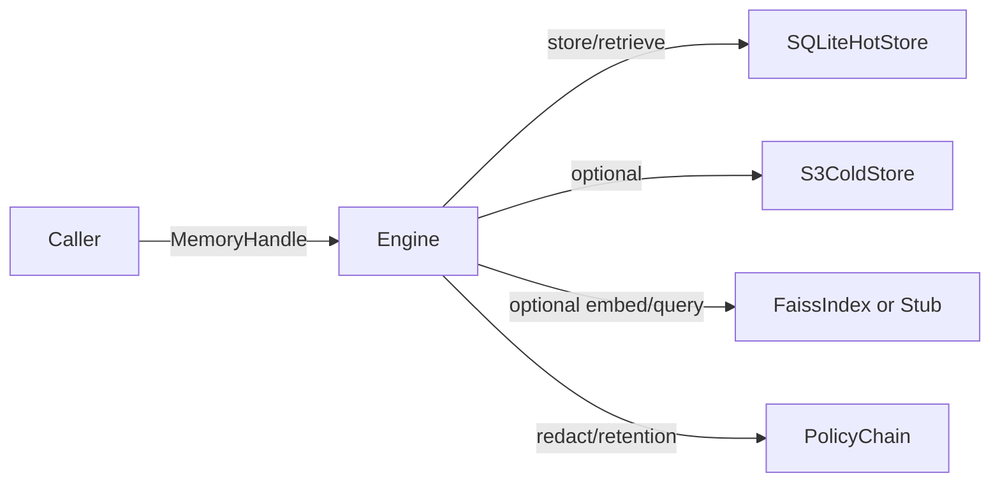

**Version:** v2.5.0  
Last-Updated: 2025-10-09

<!-- SPDX-License-Identifier: Apache-2.0
<!-- Copyright (c) 2025 OrchIntel Systems Ltd.
<!-- https://orchintel.com | https://ioa.systems
<!--
<!-- Part of IOA Core (Open Source Edition). See LICENSE at repo root.
-->

### Overview

Memory Engine 33D refactors the subsystem into clear, swappable components:

- core/interfaces.py: DTOs and stable interfaces
- core/scopes.py: `ScopedMemoryHandle` enforcing tenancy (project/user/agent)
- hot/sqlite_store.py: default hot store with SQLite + WAL
- cold/s3_store.py: S3/MinIO-backed cold store with graceful NotConfigured fallback
- vector/faiss_index.py: FAISS in-proc vector index with stub when disabled
- compliance/policy_chain.py: redaction + retention with audit hooks
- engine.py: thin orchestrator wiring the above

### Component Diagram

### Profiles

- local: hot only
- hybrid: hot + cold
- cloud: cold only

### Backward Compatibility

- `src/memory_engine.py` remains a shim; emits DeprecationWarning only when `IOA_EMIT_LEGACY_WARNINGS=1`.
- Data layout unchanged; SQLite schema preserved.

