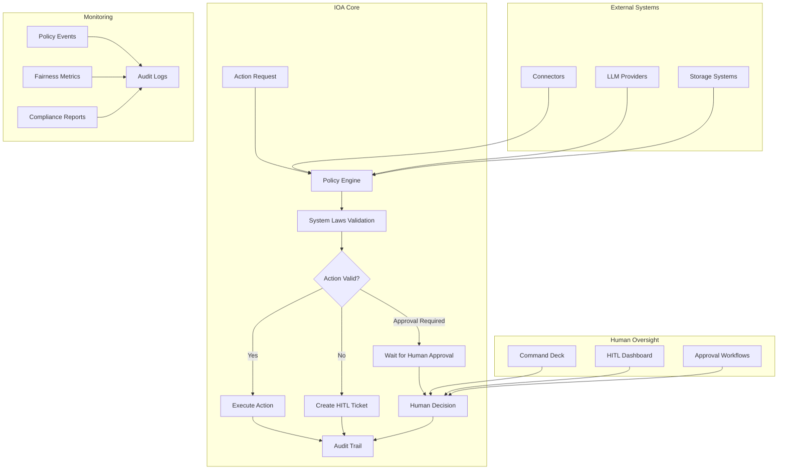
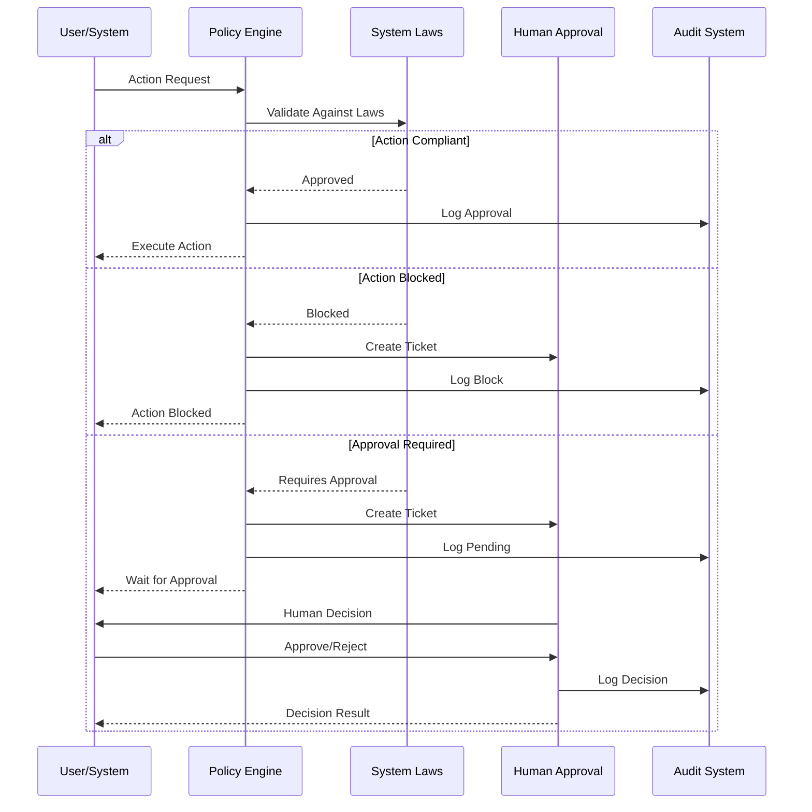
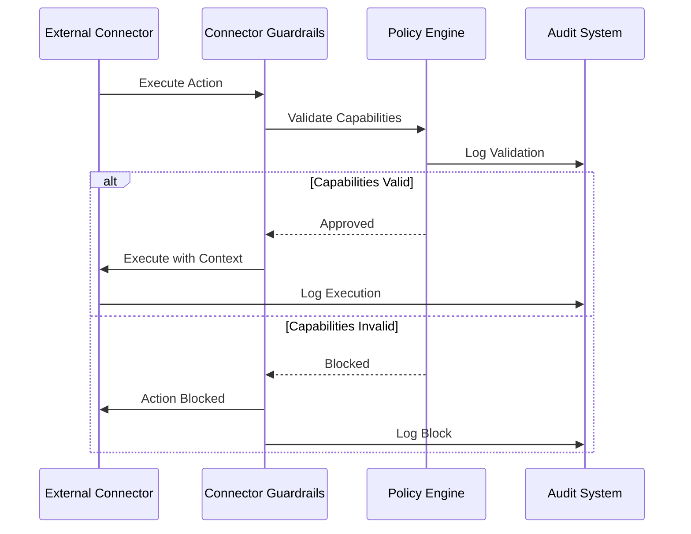

**Version:** v2.5.0  
Last-Updated: 2025-10-09

<!-- SPDX-License-Identifier: Apache-2.0
<!-- Copyright (c) 2025 OrchIntel Systems Ltd.
<!-- https://orchintel.com | https://ioa.systems
<!--
<!-- Part of IOA Core (Open Source Edition). See LICENSE at repo root.
-->

# IOA Governance Framework

**Last Updated:** 2025-09-03  
**Status:** Active - OSS Launch Gate

## Overview

The IOA Governance Framework provides a comprehensive, enforceable governance system for AI operations. Built around the **System Laws** - a set of signed, external governance rules - this framework ensures that governance is kernel-level, testable, and certifiable.

## Core Components

### 1. System Laws

The foundation of IOA governance consists of six core laws:

1. **Compliance Supremacy** - Regulatory compliance takes precedence
2. **Governance Precedence** - Governance policies override operational decisions
3. **Auditability** - Complete audit trails for all actions
4. **Immutable Governance** - Automated actions cannot override core governance
5. **Fairness & Non-Discrimination** - Bias detection and mitigation
6. **Human Oversight Supremacy** - Human approval for blocked actions

### 2. Policy Engine

The Policy Engine enforces System Laws by:

- Validating all actions against governance rules
- Calculating fairness scores and detecting bias
- Managing conflict resolution between laws
- Emitting policy events for monitoring
- Creating HITL tickets for human approval

### 3. Connector Guardrails

All external integrations must pass through governance validation:

- Capability validation against System Laws
- Jurisdiction and data classification enforcement
- Rate limiting and security clearance checks
- Audit trail generation for all operations

### 4. Human-in-the-Loop (HITL)

Human oversight capabilities include:

- Approval workflows for blocked actions
- Emergency override capabilities
- Complete audit trails for human decisions
- Integration with Command Deck interfaces

## Architecture Overview



## Governance Flow

### Action Validation Flow



### Connector Integration Flow



## Integration Points

### 1. Policy Engine Integration

The Policy Engine integrates with all major IOA components:

```python
# Example integration in roundtable executor
from src.ioa.core.governance.policy_engine import PolicyEngine

class RoundtableExecutor:
    def __init__(self):
        self.policy_engine = PolicyEngine()
    
    def execute_action(self, action_context):
        # Validate against System Laws before execution
        validation_result = self.policy_engine.validate_against_laws(action_context)
        
        if validation_result.status == "blocked":
            raise ActionBlockedError("Action blocked by System Laws")
        
        if validation_result.status == "requires_approval":
            # Create HITL ticket and wait for approval
            hitl_ticket = self._create_hitl_ticket(action_context, validation_result)
            raise ApprovalRequiredError(f"Human approval required: {hitl_ticket['ticket_id']}")
        
        # Execute action with audit trail
        result = self._execute_action(action_context)
        result["audit_id"] = validation_result.audit_id
        return result
```

### 2. Connector Integration

All connectors must inherit from the base class:

```python
from src.ioa.connectors.base import ConnectorBase, ConnectorCapabilities

class MyConnector(ConnectorBase):
    def __init__(self):
        capabilities = ConnectorCapabilities(
            name="My Connector",
            version="1.0.0",
            supported_actions=["read", "write"],
            data_classifications=["public", "internal"],
            jurisdictions=["global"]
        )
        super().__init__("my-connector", capabilities)
    
    def _execute_action(self, action_type, ctx, **kwargs):
        # Implement actual connector logic
        return {"result": "success"}
```

### 3. HITL Integration

Human approval workflows integrate with Command Deck:

```python
from apps.command_deck.hitl import create_hitl_ticket, is_ticket_approved

# Create HITL ticket
ticket = create_hitl_ticket(
    connector_id="my-connector",
    action_type="data_export",
    actor_id="user-123",
    required_approvals=[{"law_id": "law1", "details": "GDPR compliance review"}]
)

# Check approval status
if is_ticket_approved(ticket["ticket_id"]):
    # Proceed with action
    pass
```

## Configuration

### Environment Variables

```bash
# System Laws configuration
export IOA_LAWS_KEY_PATH="/path/to/public-key.pem"
export IOA_LAWS_SIGNATURE_ALG="RS256"
export IOA_LAWS_VERIFICATION_STRICT="true"

# Fairness configuration
export IOA_FAIRNESS_THRESHOLD="0.2"
export IOA_FAIRNESS_METRICS="gini_coefficient,disparity_ratio"

# Jurisdiction configuration
export IOA_RESIDENCY="EU"
export IOA_JURISDICTION_AFFINITY="EU,US,air-gapped"
```

### Policy Configuration

```yaml
# governance_config.yaml
system_laws:
  manifest_path: "src/ioa/core/governance/system_laws.json"
  verify_signature: true
  key_path: "src/ioa/core/governance/signing_keys/dev_public_key.pem"

fairness:
  threshold: 0.2
  metrics:
    - gini_coefficient
    - disparity_ratio
    - bias_detection
  mitigation_strategies:
    - output_filtering
    - prompt_adjustment
    - human_review

jurisdiction:
  default: "global"
  affinity: ["EU", "US", "air-gapped"]
  conflict_rules:
    GDPR_vs_SOX: "GDPR takes precedence for EU data"
```

## Monitoring and Metrics

### Key Metrics

Monitor these governance metrics:

1. **Policy Violations**
   - Count of law violations per time period
   - Types of violations and frequency
   - Resolution time for violations

2. **HITL Performance**
   - Number of pending approval requests
   - Average time to human decision
   - Approval/rejection ratios

3. **Fairness Metrics**
   - Distribution of fairness scores
   - Bias detection frequency
   - Mitigation strategy effectiveness

4. **Audit Coverage**
   - Percentage of actions with complete audit trails
   - Audit trail completeness scores
   - Missing audit data incidents

### Policy Events

The system emits structured policy events:

```json
{
  "event_type": "action_validated",
  "timestamp": "2025-09-03T10:00:00Z",
  "data": {
    "action_id": "action-123",
    "audit_id": "audit-456",
    "status": "approved",
    "laws_checked": ["law1", "law2", "law3"],
    "violations": [],
    "required_approvals": [],
    "fairness_score": 0.1,
    "processing_time_ms": 45
  }
}
```

## Compliance and Certification

### "Powered by IOA" Badge

Organizations can achieve the "Powered by IOA" certification by:

1. **Implementing System Laws** - All governance rules enforced
2. **Passing Conformance Tests** - All validation tests succeed
3. **Maintaining Audit Trails** - Complete traceability of operations
4. **Ensuring Fairness** - Bias detection and mitigation active
5. **Providing Human Oversight** - HITL workflows functional

### Compliance Checklist

- [ ] System Laws manifest loaded and verified at startup
- [ ] All actions validated against laws before execution
- [ ] Complete audit trails with audit_id for every action
- [ ] Fairness thresholds enforced and violations detected
- [ ] Human approval workflows functional for blocked actions
- [ ] Connector integrations respect policy enforcement
- [ ] Conformance test suite passes completely
- [ ] Regular compliance audits performed

## Security Considerations

### Key Management

- **Development:** RSA keypair for testing (never in production)
- **Production:** Keys stored in KMS/Vault, never in code
- **Rotation:** Regular key rotation procedures implemented
- **Monitoring:** Key usage and access monitoring

### Access Control

- **Policy Engine:** Restricted access to governance configuration
- **HITL System:** Role-based access for approval workflows
- **Audit Logs:** Immutable audit trail with access controls
- **Connector Validation:** Secure validation of external integrations

## Future Enhancements

### Planned Features

1. **Advanced Bias Detection** - Machine learning-based bias detection
2. **Multi-Jurisdiction Support** - Enhanced conflict resolution
3. **Policy Templates** - Reusable policy configurations
4. **Compliance Reporting** - Automated compliance documentation
5. **Integration APIs** - Third-party policy integration

### Extension Points

The governance framework is designed for extensibility:

- **Custom Laws:** Organization-specific governance rules
- **Policy Plugins:** Pluggable policy enforcement modules
- **Integration Hooks:** External system integration points
- **Custom Metrics:** Organization-specific fairness metrics

## Support and Resources

### Documentation

- **System Laws Spec:** [System Laws Specification](SYSTEM_LAWS.md)
- **Conformance Guide:** [Conformance Guide](CONFORMANCE.md)
- **Key Management:** [Key Management Guide](KEY_MANAGEMENT.md)

### Community

- **IOA Governance Forum** - Community discussions and support
- **Governance Working Group** - Technical implementation guidance
- **Compliance Network** - Best practices and compliance support

### Support

- **Technical Support:** governance-support@ioa.org
- **Compliance Support:** compliance-support@ioa.org
- **Security Support:** security-support@ioa.org

## Conclusion

The IOA Governance Framework provides a robust, enforceable governance system that ensures compliance, fairness, and human oversight in all AI operations. By implementing this framework, organizations can achieve the "Powered by IOA" certification and demonstrate their commitment to responsible AI governance.

The framework is designed to be:
- **Comprehensive** - Covers all aspects of AI governance
- **Enforceable** - Automated validation and enforcement
- **Auditable** - Complete traceability of all operations
- **Extensible** - Adaptable to organizational needs
- **Certifiable** - Enables compliance certification

For questions about implementation or compliance, contact the IOA Governance Council or refer to the supporting documentation.
