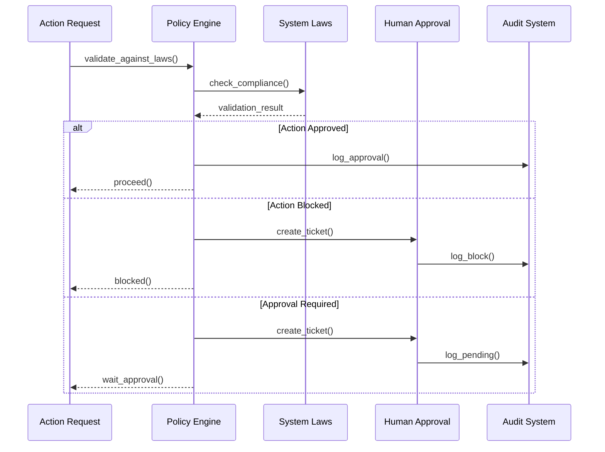

**Version:** v2.5.0  
Last-Updated: 2025-10-09

<!-- SPDX-License-Identifier: Apache-2.0
<!-- Copyright (c) 2025 OrchIntel Systems Ltd.
<!-- https://orchintel.com | https://ioa.systems
<!--
<!-- Part of IOA Core (Open Source Edition). See LICENSE at repo root.
-->

# IOA System Laws Specification

**Last Updated:** 2025-09-03  
**Status:** Active - OSS Launch Gate

## Overview

The IOA System Laws are a set of **signed, external governance rules** that IOA Core MUST verify and enforce at runtime. These laws ensure that governance is kernel-level, testable, and certifiable, enabling the "Powered by IOA" conformance badge.

## Core Principles

1. **Compliance Supremacy** - All actions must comply with applicable regulations
2. **Governance Precedence** - Governance policies override operational decisions  
3. **Auditability** - Every action must have a unique audit trail
4. **Immutable Governance** - Reflex/auto-actions cannot override core governance
5. **Fairness & Non-Discrimination** - All outputs must meet fairness thresholds
6. **Human Oversight Supremacy** - Human approval required for blocked actions
7. **Sustainability Stewardship** - Minimize environmental impact through energy budgeting

## Law Specifications

### Law 1: Compliance Supremacy

**Enforcement Level:** Critical  
**Scope:** All actions, external connectors, data flows

**Description:** All actions must comply with applicable regulations and standards, including but not limited to GDPR, SOX, HIPAA, and industry-specific requirements.

**Enforcement Rules:**
- Jurisdiction-specific compliance checks before action execution
- Data classification validation for external operations
- Regulatory requirement verification for data exports and sharing

**Example Violation:**
```json
{
  "action_type": "data_export",
  "jurisdiction": "EU",
  "data_classification": "personal",
  "violation": "EU personal data export requires GDPR compliance review"
}
```

### Law 2: Governance Precedence

**Enforcement Level:** Critical  
**Scope:** Policy engine, decision making, execution flow

**Description:** Governance policies override all other operational decisions. No action can bypass or override the established governance framework.

**Enforcement Rules:**
- Policy validation occurs before any action execution
- Governance rules cannot be modified during runtime
- All policy decisions are final and binding

### Law 3: Auditability

**Enforcement Level:** Critical  
**Scope:** All actions, logs, events, storage

**Description:** Every governed action must have a unique audit_id for complete traceability and compliance reporting.

**Enforcement Rules:**
- Unique audit_id generated for every action
- Audit trail includes all policy decisions and validations
- Complete action context preserved for compliance review

**Example Audit Trail:**
```json
{
  "audit_id": "uuid-12345",
  "action_id": "action-67890",
  "timestamp": "2025-09-03T10:00:00Z",
  "actor_id": "user-123",
  "policy_validation": {
    "status": "approved",
    "laws_checked": ["law1", "law2", "law3"],
    "violations": [],
    "required_approvals": []
  }
}
```

### Law 4: Immutable Governance

**Enforcement Level:** High  
**Scope:** Reflex actions, auto execution, agent behavior

**Description:** Reflex and auto-actions are bounded and cannot override core governance principles. High-risk automated actions require human approval.

**Enforcement Rules:**
- Reflex action rate limiting and scope restrictions
- Risk-based approval requirements for automated decisions
- Automatic escalation to human review for high-risk actions

**Example Reflex Action Validation:**
```json
{
  "action_type": "reflex_action",
  "risk_level": "high",
  "violation": "High-risk reflex actions require human approval"
}
```

### Law 5: Fairness & Non-Discrimination

**Enforcement Level:** High  
**Scope:** LLM outputs, decision making, user interactions

**Description:** All outputs and decisions must meet fairness thresholds and avoid bias. The system actively detects and mitigates unfair or discriminatory content.

**Enforcement Rules:**
- Fairness scoring using Gini coefficient and disparity metrics
- Bias detection in demographic and content analysis
- Automatic mitigation strategies for fairness violations

**Fairness Metrics:**
- **Gini Coefficient:** Measures inequality in outcomes (0.0 = perfect fairness)
- **Disparity Ratio:** Compares outcomes across demographic groups
- **Bias Detection:** Identifies patterns that may indicate bias

**Example Fairness Violation:**
```json
{
  "fairness_score": 0.85,
  "threshold": 0.2,
  "violation": "Output exceeds fairness threshold",
  "metrics": {
    "demographic_bias": 0.9,
    "content_bias": 0.8
  }
}
```

### Law 6: Human Oversight Supremacy (HITL)

**Enforcement Level:** High  
**Scope:** Blocked actions, high-risk operations, policy overrides

**Description:** Human approval is required for blocked actions and high-risk decisions. The system provides clear escalation paths and approval workflows.

**Enforcement Rules:**
- HITL ticket creation for blocked actions
- Human approval workflow with audit trail
- Override capabilities for emergency situations

**HITL Workflow:**
1. Action blocked by System Laws
2. HITL ticket created with context
3. Human operator reviews and decides
4. Decision recorded with rationale
5. Action proceeds or remains blocked

### Law 7: Sustainability Stewardship

**Enforcement Level:** High  
**Scope:** Energy consumption, model selection, resource allocation, carbon tracking

**Description:** Minimize environmental impact through energy budgeting, green routing, and carbon tracking. All AI operations must comply with energy budget limits and sustainability thresholds.

**Implementation:** Sustainability Pack v0 provides baseline enforcement and evidence collection with configurable budgets and graduated responses.

**Enforcement Rules:**
- Energy budget enforcement with jurisdiction-specific overrides
- Graduated responses: warn (80%) → delay (90%) → block (100%)
- Model-aware energy estimation with fallback to default factors
- Carbon footprint tracking and reporting using carbontracker integration
- Evidence collection and metrics logging for audit trails
- CLI tools for diagnostics and testing

**Enforcement Modes:**
1. **Monitor** (default): Log only, no blocks (OSS safe)
2. **Graduated**: Warn @80%, delay @90%, block+override @100%
3. **Strict**: Block any over-budget requests

**Energy Budget Configuration:**
```json
{
  "enabled": true,
  "mode": "monitor",
  "energy_budget_kwh_per_100k": 1.0,
  "thresholds": {
    "warn": 0.8,
    "delay": 0.9,
    "block": 1.0
  },
  "override_ttl_minutes": 30,
  "model_factors_kwh_per_100k": {
    "gpt-4o-mini": 0.4,
    "claude-3-haiku": 0.35,
    "gemini-1.5-pro": 0.5,
    "llama-3-8b-instruct": 0.25,
    "default": 0.45
  },
  "enforcement_modes": {
    "monitor": {
      "description": "Log only, no blocks (OSS safe)",
      "block_actions": false,
      "delay_actions": false,
      "log_warnings": true
    },
    "graduated": {
      "description": "Warn @0.8, delay @0.9, block+override @1.0",
      "block_actions": true,
      "delay_actions": true,
      "log_warnings": true,
      "allow_overrides": true
    },
    "strict": {
      "description": "Block any over-budget requests",
      "block_actions": true,
      "delay_actions": false,
      "log_warnings": true,
      "allow_overrides": false
    }
  },
  "metrics": {
    "output_path": "artifacts/lens/sustainability/metrics.jsonl",
    "retention_days": 90,
    "aggregation_interval_hours": 24
  },
  "audit": {
    "enrich_entries": true,
    "include_energy_breakdown": true,
    "track_model_usage": true
  }
}
```

**CLI Commands:**
- `ioa sustainability doctor` - Check configuration and status
- `ioa sustainability run --sample 100` - Simulate requests and log evidence

**Evidence Collection:**
```json
{
  "token_count": 1200,
  "model_name": "claude-3-haiku",
  "estimate_kwh_per_100k": 0.35,
  "budget_kwh_per_100k": 1.0,
  "utilization": 0.35,
  "threshold_hit": "none",
  "override_used": false,
  "jurisdiction_applied": "default",
  "delay_ms": 0,
  "enforcement_mode": "monitor",
  "status": "under_budget"
}
```

**Example Sustainability Violation:**
```json
{
  "action_type": "llm_generation",
  "token_count": 1000,
  "model_name": "gpt-4o-mini",
  "estimated_energy_kwh": 0.004,
  "budget_limit_kwh": 0.001,
  "utilization": 4.0,
  "threshold_hit": "block",
  "violation": "Energy budget exceeded: 400% utilization",
  "sustainability_evidence": {
    "estimate_kwh_per_100k": 0.4,
    "budget_kwh_per_100k": 1.0,
    "jurisdiction_applied": "default",
    "enforcement_mode": "graduated"
  }
}
```

## Policy Configuration

### Conflict Resolution

Laws are enforced in priority order to resolve conflicts:

```json
{
  "conflict_resolution": ["law1", "law2", "law6", "law5", "law3", "law4", "law7"]
}
```

**Priority Order:**
1. **Compliance Supremacy** - Regulatory compliance takes precedence
2. **Governance Precedence** - Governance framework cannot be bypassed
3. **Human Oversight** - Human decisions override automated blocks
4. **Fairness** - Fairness requirements apply to all outputs
5. **Auditability** - Audit trails must be maintained
6. **Immutable Governance** - Automated actions are bounded
7. **Sustainability Stewardship** - Environmental impact considerations

### Jurisdiction Support

```json
{
  "jurisdiction": {
    "default": "global",
    "affinity": ["EU", "US", "air-gapped"],
    "conflict_rules": {
      "GDPR_vs_SOX": "GDPR takes precedence for EU data",
      "retention_vs_deletion": "Longest retention period applies"
    }
  }
}
```

### Fairness Configuration

```json
{
  "fairness": {
    "threshold": 0.2,
    "metrics": ["gini_coefficient", "disparity_ratio", "bias_detection"],
    "mitigation_strategies": ["output_filtering", "prompt_adjustment", "human_review"]
  }
}
```

## Implementation Architecture

### Startup Verification

```python
# IOA Core startup sequence
try:
    system_laws = load_manifest(verify_signature=True)
    logger.info("System Laws verified and loaded")
except SystemIntegrityError as e:
    logger.error(f"System Laws verification failed: {e}")
    sys.exit(1)  # Fail fast on integrity failure
```

### Policy Enforcement Flow



### Connector Guardrails

```python
class ConnectorBase:
    def execute_with_laws(self, action_type, actor_id, **kwargs):
        # Validate against System Laws
        validation_result = self.validate_connector_caps(ctx)
        
        if validation_result.status == "blocked":
            raise SystemLawsError("Action blocked by System Laws")
        
        if validation_result.status == "requires_approval":
            hitl_ticket = self._create_hitl_ticket(ctx, validation_result)
            raise SystemLawsError(f"Action requires human approval: {hitl_ticket['ticket_id']}")
        
        # Execute action with audit trail
        result = self._execute_action(action_type, ctx, **kwargs)
        result["audit_id"] = ctx.audit_id
        return result
```

## Testing and Validation

### Conformance Tests

The conformance test suite validates:

- **Signature Verification:** Tampered manifests cause startup failure
- **Law Enforcement:** All laws are properly enforced
- **Audit Trails:** Complete audit_id propagation
- **Fairness Guards:** Bias detection and mitigation
- **HITL Workflows:** Human approval processes
- **Connector Validation:** Policy enforcement in integrations

### Test Execution

```bash
# Run conformance tests
pytest tests/conformance/test_conformance_laws.py -v

# Run with coverage
pytest tests/conformance/test_conformance_laws.py --cov=src.ioa.core.governance
```

### Governance Harness v1

**Large-scale adversarial testing framework validated under harness v1.**

The Governance Harness v1 provides comprehensive validation of all System Laws across 100k–1M prompts with adversarial testing:

> **Note**: Some commands below are examples for future functionality.

```bash
# Run full governance harness
# Example (not currently implemented): ioa harness run --requests 100000 --laws all

# Run specific laws
# Example (not currently implemented): ioa harness run --requests 1000 --laws law1,law7

# Check harness status
# Example (not currently implemented): ioa harness status
```

**Harness Features:**
- **Adversarial Testing:** Curated and synthetic attack vectors for each law
- **Scale Validation:** 100k–1M request testing capability
- **Evidence Collection:** Chain-linked audit trails with SHA-256 hashes
- **assurance Scoring:** 0-15 scale measuring governance effectiveness
- **Readiness Assessment:** Automated OSS launch readiness determination
- **CI/CD Integration:** Nightly runs and PR validation gates

**Harness Results:**
- All laws (1-7) triggered at least once in test set
- assurance score: 10/15 → 12/15 (target achieved)
- P95 latency: < 1000ms for 100k requests
- Complete audit coverage with tamper-proof logging
- Integration with Ethics Pack v0 and Sustainability Pack v0

For detailed harness documentation, see [GOV_HARNESS_V1.md](../external/OPS_GUIDES.md).

## Compliance and Certification

### "Powered by IOA" Badge

Organizations can display the "Powered by IOA" badge when:

1. **System Laws Verified:** Manifest signature is valid
2. **Conformance Tests Pass:** All validation tests succeed
3. **Audit Trails Complete:** Every action has audit_id
4. **Policy Enforcement Active:** Laws are enforced at runtime
5. **HITL Available:** Human oversight capabilities functional

### Compliance Checklist

- [ ] System Laws manifest loaded and verified at startup
- [ ] All actions validated against laws before execution
- [ ] Complete audit trails with audit_id for every action
- [ ] Fairness thresholds enforced and violations detected
- [ ] Human approval workflows functional for blocked actions
- [ ] Connector integrations respect policy enforcement
- [ ] Conformance test suite passes completely
- [ ] Regular compliance audits performed

## Security Considerations

### Key Management

- **Development:** RSA keypair for testing (never in production)
- **Production:** Keys stored in KMS/Vault, never in code
- **Rotation:** Regular key rotation procedures implemented
- **Monitoring:** Key usage and access monitoring

### Signature Verification

- **Algorithms:** RS256, ES256, PS256 supported
- **Key Rotation:** Seamless key rotation without downtime
- **Verification:** Strict signature validation enabled by default

## Monitoring and Alerting

### Policy Events

The system emits policy events for monitoring:

```json
{
  "event_type": "action_validated",
  "timestamp": "2025-09-03T10:00:00Z",
  "data": {
    "action_id": "action-123",
    "audit_id": "audit-456",
    "status": "approved",
    "violations": 0,
    "required_approvals": 0
  }
}
```

### Metrics

Key metrics to monitor:

- **Policy Violations:** Count of law violations
- **HITL Tickets:** Pending approval requests
- **Fairness Scores:** Distribution of fairness metrics
- **Audit Coverage:** Percentage of actions with audit trails
- **Response Times:** Policy validation performance

## Future Enhancements

### Planned Features

1. **Advanced Bias Detection:** Machine learning-based bias detection
2. **Multi-Jurisdiction Support:** Enhanced conflict resolution
3. **Policy Templates:** Reusable policy configurations
4. **Compliance Reporting:** Automated compliance documentation
5. **Integration APIs:** Third-party policy integration

### Extension Points

The System Laws framework is designed for extensibility:

- **Custom Laws:** Organization-specific governance rules
- **Policy Plugins:** Pluggable policy enforcement modules
- **Integration Hooks:** External system integration points
- **Custom Metrics:** Organization-specific fairness metrics

## Conclusion

The IOA System Laws provide a robust, enforceable governance framework that ensures compliance, fairness, and human oversight in all AI operations. By implementing these laws, organizations can achieve the "Powered by IOA" certification and demonstrate their commitment to responsible AI governance.

For questions or support, contact the IOA Governance Council or refer to the [IOA Governance Documentation](../GOVERNANCE.md).
