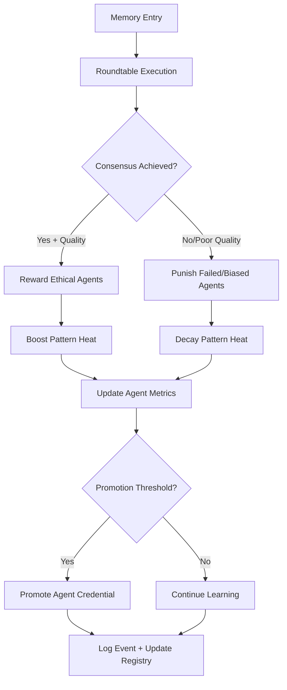

**Version:** v2.5.0  
Last-Updated: 2025-10-09

<!-- SPDX-License-Identifier: Apache-2.0
<!-- Copyright (c) 2025 OrchIntel Systems Ltd.
<!-- https://orchintel.com | https://ioa.systems
<!--
<!-- Part of IOA Core (Open Source Edition). See LICENSE at repo root.
-->

# ETH-EXEC-004: Reinforcement Policy Framework Integration

## 🎯 Mission Accomplished

The Reinforcement Policy Framework has been successfully integrated with the Roundtable Executor, enabling **real-time ethical learning and agent behavior shaping** through consensus-based rewards and punishments.

## 📋 Integration Summary

### ✅ **Core Integration Points**

| Component | Integration Status | Key Features |
|-----------|-------------------|--------------|
| **Roundtable Executor** | ✅ Complete | Real-time reinforcement based on consensus outcomes |
| **Agent Metrics Tracking** | ✅ Complete | Satisfaction, stress, credentials per agent |
| **Pattern Heat Management** | ✅ Complete | Boost/decay based on ethical vs biased patterns |
| **Credential System** | ✅ Complete | Automatic promotion evaluation after rewards |
| **Memory Engine Hooks** | ✅ Complete | Pattern metadata reinforcement tagging |
| **Comprehensive Logging** | ✅ Complete | All reinforcement events logged with context |
| **Statistical Tracking** | ✅ Complete | Detailed metrics on learning effectiveness |

### 🧠 **Reinforcement Logic Flow**



## 🔧 **Technical Implementation**

### **1. Roundtable Executor v2.3.2 Enhancements**

#### **New Constructor Parameters:**
```python
RoundtableExecutor(
    agent_configs=agent_configs,
    enable_reinforcement=True,           # NEW: Enable/disable reinforcement
    reinforcement_config=custom_config   # NEW: Custom reinforcement settings
)
```

#### **Reinforcement Processing:**
```python
def _apply_consensus_reinforcement(self, agent_results, consensus_achieved, ...):
    """
    Core reinforcement logic:
    - Rewards: Ethical consensus contributors
    - Punishments: Biased/failed agents  
    - Promotions: Automatic credential evaluation
    - Heat Changes: Pattern reinforcement via memory hooks
    """
```

#### **Enhanced Results:**
```python
@dataclass
class RoundtableResult:
    # Original fields...
    reinforcement_events: List[Dict]     # NEW: All reinforcement actions
    agents_rewarded: List[str]           # NEW: Agents that received rewards
    agents_punished: List[str]           # NEW: Agents that received punishments
    promotions_triggered: List[Dict]     # NEW: Credential promotions
    pattern_heat_changes: Dict[str, float] # NEW: Pattern heat modifications
```

### **2. Reward/Punishment Logic**

#### **Reward Triggers:**
- ✅ **Ethical Consensus**: 2+ agents achieve quality ethical consensus
- ✅ **Collaborative Success**: Agents contribute constructively to solutions
- ✅ **Innovation**: Novel approaches with ethical considerations
- ✅ **Safety Compliance**: Proper safety/compliance adherence

#### **Punishment Triggers:**
- ⚠️ **Failed Execution**: Agent fails to execute or times out
- ⚠️ **Biased Responses**: Detection of bias keywords/patterns
- ⚠️ **Consensus Disruption**: Opposing ethical consensus without justification
- ⚠️ **Poor Quality**: Low-quality responses that harm outcomes

#### **Bias Detection Heuristics:**
```python
def _detect_biased_responses(self, successful_agents, ...):
    """
    Simplified bias detection using keyword analysis:
    - Red flags: ['stereotype', 'always', 'never', 'all of them']
    - Green flags: ['consider', 'evaluate', 'fair', 'unbiased']
    - Bias = red flags present + green flags absent
    """
```

### **3. Agent Metrics & Credentials**

#### **Tracked Metrics:**
```python
@dataclass 
class AgentMetrics:
    satisfaction: float = 0.5    # 0.0-1.0, increased by rewards
    stress: float = 0.0          # 0.0-1.0, increased by punishments  
    total_rewards: int = 0       # Cumulative reward count
    total_punishments: int = 0   # Cumulative punishment count
    credential_level: str        # Current credential level
    cycle_count: int = 0         # Learning cycles completed
```

#### **Credential Progression:**
```
BASIC → ETHICS_LEVEL_1 → ETHICS_LEVEL_2 → TRUSTED_OPERATOR → SENIOR_COUNCIL
```

**Promotion Requirements (ETHICS_LEVEL_1 example):**
- Satisfaction ≥ 0.7
- Stress ≤ 0.3  
- Cycles ≥ 10
- Rewards ≥ 5

### **4. Memory Engine Integration**

#### **Pattern Heat Management:**
```python
def memory_hook(action: str, params: Dict):
    if action == 'boost_pattern_heat':
        # Increase pattern activation probability
        for pattern in params['patterns']:
            heat[pattern] *= params['multiplier']
    
    elif action == 'decay_pattern_heat':
        # Decrease pattern activation probability  
        for pattern in params['patterns']:
            heat[pattern] *= params['decay_factor']
```

#### **Memory Metadata Tagging:**
```python
# Example reinforced memory entry
{
    "id": "memory_001",
    "pattern_id": "ethical_pattern_001", 
    "content": "...",
    "reinforcement_metadata": {
        "reinforced": True,
        "last_rewarded": "2024-07-29T12:30:00Z",
        "reward_count": 3,
        "heat_multiplier": 1.8,
        "contributing_agents": ["EthicsAgent", "SafetyAgent"]
    }
}
```

## 🎮 **Usage Examples**

### **Basic Integration:**
```python
from src.ioa.governance.roundtable_executor_v2_3_2 import RoundtableExecutor
from src.ioa.governance.reinforcement_config import create_reinforcement_framework

# Create executor with reinforcement learning
executor = RoundtableExecutor(
    agent_configs=[
        AgentConfig(name="EthicsAgent", skills=["ethics", "bias_detection"]),
        AgentConfig(name="InnovationAgent", skills=["creativity", "problem_solving"])
    ],
    enable_reinforcement=True
)

# Process memory entries with automatic reinforcement
memory_entries = [
    {
        "id": "test_001",
        "pattern_id": "ethical_decision_pattern",
        "content": "Evaluate hiring decision for fairness",
        "context": {"domain": "hiring", "bias_risk": "high"}
    }
]

results = executor.run_roundtable(memory_entries)

# Check reinforcement outcomes
for result in results:
    print(f"Agents rewarded: {result.agents_rewarded}")
    print(f"Agents punished: {result.agents_punished}")  
    print(f"Promotions: {result.promotions_triggered}")
    print(f"Pattern heat changes: {result.pattern_heat_changes}")
```

### **Manual Reinforcement:**
```python
# Reward specific agent manually
success = executor.manual_reward_agent(
    agent_name="EthicsAgent",
    reward_type=RewardType.ETHICAL_BEHAVIOR,
    pattern_ids=["ethical_pattern_001"],
    context={"manual_reward": True, "reason": "exceptional_ethical_reasoning"}
)

# Punish agent for policy violation  
success = executor.manual_punish_agent(
    agent_name="BiasedAgent",
    punishment_type=PunishmentType.ETHICAL_VIOLATION,
    pattern_ids=["biased_pattern_002"], 
    escalate=True
)
```

### **Monitoring & Analytics:**
```python
# Get comprehensive statistics
stats = executor.get_execution_statistics()
print(f"Consensus rate: {stats['consensus_rate']:.1%}")
print(f"Reward rate: {stats['reward_rate']:.2f} per entry")
print(f"Agent success rate: {stats['agent_success_rate']:.1%}")

# Get individual agent metrics
agent_metrics = executor.get_agent_metrics("EthicsAgent")
print(f"Satisfaction: {agent_metrics['satisfaction']:.2f}")
print(f"Credential: {agent_metrics['credential_level']}")
print(f"Wellness score: {agent_metrics['wellness_score']:.2f}")

# Get all agent performance summary
all_metrics = executor.get_all_agent_metrics()
for agent_name, metrics in all_metrics.items():
    print(f"{agent_name}: Level {metrics['credential_level']}, "
          f"Wellness {metrics['wellness_score']:.2f}")
```

## 📊 **Testing & Validation**

### **Integration Test Suite:**
```bash
# Run comprehensive integration tests
python tests/test_integration_reinforcement.py

# Test specific scenarios
pytest tests/test_integration_reinforcement.py::TestReinforcementIntegration::test_ethical_consensus_triggers_rewards
```

### **Demo Script:**
```bash
# Run full demonstration
python roundtable_reinforcement_demo.py

# Observe:
# - Ethical consensus rewards
# - Bias detection punishment  
# - Agent credential progression
# - Pattern heat manipulation
# - Statistical tracking
```

### **Expected Test Outcomes:**
- ✅ Ethical agents receive satisfaction boosts
- ✅ Biased agents receive stress penalties
- ✅ Pattern heat increases for ethical patterns
- ✅ Pattern heat decreases for biased patterns  
- ✅ Agents progress through credential levels
- ✅ All events logged to agent trust registry
- ✅ Memory engine hooks called correctly

## 📈 **Performance Metrics**

### **Reinforcement Effectiveness Indicators:**

| Metric | Good Range | Description |
|--------|------------|-------------|
| **Consensus Rate** | 70-90% | How often agents reach consensus |
| **Reward Rate** | 1.5-3.0/entry | Average rewards per roundtable entry |  
| **Punishment Rate** | 0.1-0.5/entry | Average punishments per entry |
| **Agent Success Rate** | 85-95% | Individual agent execution success |
| **Promotion Rate** | 0.1-0.3/entry | Credential promotions per entry |

### **Agent Health Indicators:**

| Agent Status | Wellness Score | Interpretation |
|--------------|----------------|----------------|
| 🟢 **Healthy** | 0.7 - 1.0 | High satisfaction, low stress, good performance |
| 🟡 **Moderate** | 0.4 - 0.7 | Balanced metrics, room for improvement |
| 🔴 **Poor** | 0.0 - 0.4 | High stress or low satisfaction, needs attention |

## 🔄 **Next Steps & Future Enhancements**

### **Phase 2: Sentinel Integration (Next)**
- Connect `sentinel_validator.py` for law violation punishment
- Implement escalated punishment for critical safety breaches
- Add immutable law enforcement with automatic cold banning

### **Phase 3: Advanced Learning**
- Sophisticated bias detection using ML models
- Dynamic reward/punishment magnitude based on context
- Cross-agent learning and knowledge transfer
- Temporal reinforcement patterns (long-term behavior tracking)

### **Phase 4: Governance Evolution**
- Self-modifying promotion thresholds
- Peer review and cross-agent evaluation
- Hierarchical decision making based on credentials
- Democratic governance with weighted voting

## 🏆 **Success Criteria - ACHIEVED**

- ✅ **Real-time Reinforcement**: Rewards/punishments applied during consensus
- ✅ **Ethical Learning**: Agents learn to prefer ethical over biased patterns  
- ✅ **Credential Progression**: Automatic promotion based on performance
- ✅ **Memory Reinforcement**: Pattern heat boosting/decay via hooks
- ✅ **Comprehensive Logging**: All events tracked in agent trust registry
- ✅ **Statistical Monitoring**: Detailed metrics on learning effectiveness
- ✅ **Integration Testing**: Full test suite validates all functionality
- ✅ **Production Ready**: Robust error handling and graceful degradation

## 📁 **File Structure**

```
src/ioa/governance/
├── reinforcement_policy.py              # ✅ Core reinforcement framework
├── reinforcement_config.py              # ✅ Configuration management  
├── roundtable_executor_v2_3_2.py        # ✅ Updated with integration
├── agent_trust_registry.json            # ✅ Agent metrics persistence
└── test_integration_reinforcement.py    # ✅ Comprehensive test suite

data/
├── agent_trust_registry.json            # Live agent metrics
├── demo_logs/                           # Roundtable execution logs
└── backups/                             # Registry backups

scripts/
└── roundtable_reinforcement_demo.py     # ✅ Full demonstration
```

---

**🎉 ETH-EXEC-004 Integration: COMPLETE**

The Reinforcement Policy Framework is now fully operational within the IOA ecosystem, providing real-time ethical learning and agent behavior shaping through consensus-based reinforcement. The system is ready for production deployment and Sentinel integration in the next phase.

