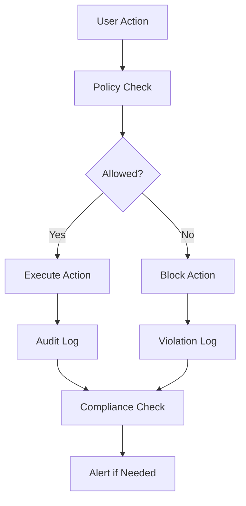

**Version:** v2.5.0  
Last-Updated: 2025-10-09

<!-- SPDX-License-Identifier: Apache-2.0
<!-- Copyright (c) 2025 OrchIntel Systems Ltd.
<!-- https://orchintel.com | https://ioa.systems
<!--
<!-- Part of IOA Core (Open Source Edition). See LICENSE at repo root.
-->

# Governance & Audit Tutorial

This tutorial guides you through implementing end-to-end governance and audit mechanisms in IOA Core, including audit chain hooks, compliance monitoring, and policy enforcement.

## Prerequisites

- IOA Core installed and configured
- Basic understanding of governance concepts
- Access to audit logs and monitoring tools

## Quick Start (10 minutes)

### Step 1: Enable Governance Features

```bash
# Enable audit logging
export IOA_AUDIT_ENABLED=true
export IOA_AUDIT_LOG_PATH="./logs/audit/"

# Enable PKI verification
export IOA_PKI_ENABLED=true
export IOA_PKI_KEYS_PATH="./keys/"

# Enable compliance monitoring
export IOA_COMPLIANCE_ENABLED=true
```

### Step 2: Create Audit Policy

```yaml
# audit_policy.yaml
audit:
  enabled: true
  log_level: INFO
  rotation:
    size_mb: 10
    retention_days: 90
  
  events:
    - agent_onboarding
    - agent_removal
    - workflow_execution
    - data_access
    - policy_violation
  
  redaction:
    enabled: true
    patterns:
      - "sk-[a-zA-Z0-9]{48}"
      - "[a-zA-Z0-9._%+-]+@[a-zA-Z0-9.-]+\.[a-zA-Z]{2,}"
```

### Step 3: Test Governance System

> **Note**: Some commands below are examples for future functionality.

```bash
# Test audit logging
# Example (not currently implemented): ioa governance audit test

# Verify audit chain
# Example (not currently implemented): ioa governance audit verify

# Check compliance status
# Example (not currently implemented): ioa governance compliance status
```

## Detailed Walkthrough

### 1. Governance Architecture

IOA Core provides a comprehensive governance framework with multiple layers:

#### Core Components

- **Audit Chain**: Comprehensive logging with redaction and rotation
- **PKI Engine**: Digital signature verification for trust
- **Policy Engine**: Rule-based access control and compliance
- **Compliance Monitor**: Real-time policy violation detection

#### Governance Flow



### 2. Audit Chain Implementation

#### Basic Audit Setup

```python
from src.governance.audit_chain import AuditChain
from src.governance.policy_engine import PolicyEngine

# Initialize governance components
audit = AuditChain(
    log_path="./logs/audit/",
    rotation_size_mb=10,
    retention_days=90,
    redaction_enabled=True
)

policy = PolicyEngine(
    policy_file="audit_policy.yaml",
    enforcement_mode="strict"
)

# Enable governance hooks
audit.enable_hooks()
policy.enable_enforcement()
```

#### Audit Event Types

```python
# Agent lifecycle events
audit.log(
    event_type="agent_onboarding",
    user_id="admin",
    resource_id="agent_123",
    action="create",
    details={
        "capabilities": ["analysis", "summary"],
        "tenant_id": "tenant_456",
        "trust_level": "verified"
    }
)

# Workflow execution events
audit.log(
    event_type="workflow_execution",
    user_id="user_789",
    resource_id="workflow_abc",
    action="start",
    details={
        "workflow_name": "data_analysis",
        "agents": ["agent_123", "agent_456"],
        "input_size": "1.2MB"
    }
)

# Data access events
audit.log(
    event_type="data_access",
    user_id="agent_123",
    resource_id="dataset_xyz",
    action="read",
    details={
        "data_type": "sensitive",
        "access_reason": "analysis",
        "compliance_tags": ["GDPR", "HIPAA"]
    }
)
```

#### Audit Log Structure

```json
{
  "event_id": "evt_20250819_143022_001",
  "timestamp": "2025-08-19T14:30:22.123Z",
  "event_type": "agent_onboarding",
  "user_id": "admin",
  "resource_id": "agent_123",
  "action": "create",
  "details": {
    "capabilities": ["analysis", "summary"],
    "tenant_id": "tenant_456",
    "trust_level": "verified"
  },
  "ip_address": "192.168.1.100",
  "user_agent": "ioa-cli/2.5.0",
  "redacted": false,
  "compliance_tags": ["SOX", "GDPR"],
  "risk_score": 0.1
}
```

### 3. PKI Integration

#### Key Management

> **Note**: Some commands below are examples for future functionality.

```bash
# Generate key pair for signing
# Example (not currently implemented): ioa governance pki generate --algorithm ed25519 --output-dir ./keys/

# Generate key pair for verification
# Example (not currently implemented): ioa governance pki generate --algorithm ed25519 --output-dir ./keys/ --type verification

# List available keys
# Example (not currently implemented): ioa governance pki list

# Export public key
# Example (not currently implemented): ioa governance pki export --key-id key_123 --output-file public_key.pem
```

#### Digital Signatures

```python
from src.governance.signature_engine import SignatureEngine

# Initialize signature engine
engine = SignatureEngine(algorithm="ed25519")

# Load private key
with open("./keys/private_key.pem", "rb") as f:
    private_key = f.read()

# Sign agent manifest
manifest = {
    "agent_id": "agent_123",
    "capabilities": ["analysis", "summary"],
    "tenant_id": "tenant_456"
}

signature = engine.sign(json.dumps(manifest, sort_keys=True), private_key)

# Verify signature
with open("./keys/public_key.pem", "rb") as f:
    public_key = f.read()

is_valid = engine.verify(
    json.dumps(manifest, sort_keys=True),
    signature,
    public_key
)

print(f"Signature valid: {is_valid}")
```

#### Trust Verification

```python
# Verify agent trust during onboarding
def verify_agent_trust(manifest: dict, signature: str, public_key: bytes) -> bool:
    # Verify signature
    if not engine.verify(json.dumps(manifest, sort_keys=True), signature, public_key):
        return False
    
    # Check trust level
    trust_level = manifest.get("trust_level", "unknown")
    if trust_level not in ["verified", "trusted", "certified"]:
        return False
    
    # Verify tenant isolation
    tenant_id = manifest.get("tenant_id")
    if not verify_tenant_access(tenant_id):
        return False
    
    return True
```

### 4. Policy Engine

#### Policy Definition

```yaml
# governance_policy.yaml
policies:
  - name: "Data Access Control"
    description: "Control access to sensitive data"
    rules:
      - action: "data_access"
        conditions:
          - field: "data_type"
            operator: "in"
            values: ["sensitive", "confidential"]
          - field: "user_trust_level"
            operator: "gte"
            value: "verified"
        effect: "allow"
        audit: true
    
  - name: "Agent Isolation"
    description: "Ensure agent tenant isolation"
    rules:
      - action: "agent_onboarding"
        conditions:
          - field: "tenant_id"
            operator: "exists"
          - field: "user_tenant"
            operator: "eq"
            field: "agent_tenant"
        effect: "allow"
        audit: true
    
  - name: "Workflow Compliance"
    description: "Ensure workflow compliance with regulations"
    rules:
      - action: "workflow_execution"
        conditions:
          - field: "compliance_tags"
            operator: "contains"
            value: "GDPR"
          - field: "data_processing"
            operator: "eq"
            value: "EU"
        effect: "allow"
        audit: true
        compliance_check: true

compliance:
  gdpr:
    enabled: true
    data_retention_days: 30
    right_to_forget: true
  
  sox:
    enabled: true
    audit_retention_years: 7
    financial_data: true
  
  hipaa:
    enabled: false
    phi_handling: false
```

#### Policy Enforcement

```python
from src.governance.policy_engine import PolicyEngine

# Load policy configuration
policy = PolicyEngine("governance_policy.yaml")

# Check policy compliance
def check_policy_compliance(action: str, context: dict) -> PolicyResult:
    result = policy.evaluate(action, context)
    
    if result.allowed:
        # Log allowed action
        audit.log(
            event_type="policy_check",
            user_id=context.get("user_id"),
            resource_id=context.get("resource_id"),
            action=action,
            details={
                "policy_result": "allowed",
                "rule_applied": result.rule_name,
                "compliance_tags": result.compliance_tags
            }
        )
        return result
    else:
        # Log denied action
        audit.log(
            event_type="policy_violation",
            user_id=context.get("user_id"),
            resource_id=context.get("resource_id"),
            action=action,
            details={
                "policy_result": "denied",
                "rule_applied": result.rule_name,
                "violation_reason": result.reason,
                "compliance_tags": result.compliance_tags
            }
        )
        
        # Trigger alert if needed
        if result.risk_score > 0.7:
            trigger_security_alert(result)
        
        return result
```

### 5. Compliance Monitoring

#### Real-time Monitoring

```python
from src.governance.compliance_monitor import ComplianceMonitor

# Initialize compliance monitor
monitor = ComplianceMonitor(
    policies=["governance_policy.yaml"],
    alert_threshold=0.8,
    real_time=True
)

# Start monitoring
monitor.start()

# Register compliance hooks
@monitor.compliance_hook("data_access")
def monitor_data_access(event: AuditEvent):
    # Check GDPR compliance
    if "GDPR" in event.compliance_tags:
        if event.details.get("data_processing") == "EU":
            # Verify data retention policy
            if not verify_gdpr_retention(event.resource_id):
                monitor.raise_violation(
                    "GDPR_RETENTION_VIOLATION",
                    event,
                    risk_score=0.9
                )

@monitor.compliance_hook("workflow_execution")
def monitor_workflow_compliance(event: AuditEvent):
    # Check SOX compliance for financial workflows
    if "SOX" in event.compliance_tags:
        if event.details.get("workflow_type") == "financial":
            # Verify audit trail
            if not verify_sox_audit_trail(event.resource_id):
                monitor.raise_violation(
                    "SOX_AUDIT_VIOLATION",
                    event,
                    risk_score=0.8
                )
```

#### Compliance Reporting

> **Note**: Some commands below are examples for future functionality.

```bash
# Generate compliance report
# Example (not currently implemented): ioa governance compliance report --format json --output-file compliance_report.json

# Check specific compliance framework
# Example (not currently implemented): ioa governance compliance check --framework GDPR

# Export compliance data
# Example (not currently implemented): ioa governance compliance export --framework SOX --start-date 2025-01-01 --end-date 2025-08-19
```

### 6. Advanced Governance Features

#### Risk Scoring

```python
# Calculate risk score for actions
def calculate_risk_score(action: str, context: dict) -> float:
    base_score = 0.0
    
    # Data sensitivity
    if context.get("data_type") == "sensitive":
        base_score += 0.3
    elif context.get("data_type") == "confidential":
        base_score += 0.5
    
    # User trust level
    trust_level = context.get("user_trust_level", "unknown")
    if trust_level == "unknown":
        base_score += 0.4
    elif trust_level == "verified":
        base_score += 0.1
    elif trust_level == "trusted":
        base_score += 0.05
    
    # Compliance requirements
    compliance_tags = context.get("compliance_tags", [])
    if "HIPAA" in compliance_tags:
        base_score += 0.3
    if "SOX" in compliance_tags:
        base_score += 0.2
    
    # Time-based factors
    hour = datetime.now().hour
    if hour < 6 or hour > 22:  # Off-hours
        base_score += 0.2
    
    return min(base_score, 1.0)
```

#### Automated Response

```python
# Automated response to policy violations
@monitor.violation_handler("HIGH_RISK")
def handle_high_risk_violation(violation: PolicyViolation):
    # Immediate response
    if violation.risk_score > 0.8:
        # Block user access
        block_user_access(violation.user_id)
        
        # Notify security team
        notify_security_team(violation)
        
        # Create incident ticket
        create_incident_ticket(violation)
        
        # Log response action
        audit.log(
            event_type="automated_response",
            user_id="system",
            resource_id=violation.resource_id,
            action="block_access",
            details={
                "violation_id": violation.violation_id,
                "response_type": "immediate_block",
                "risk_score": violation.risk_score
            }
        )

@monitor.violation_handler("MEDIUM_RISK")
def handle_medium_risk_violation(violation: PolicyViolation):
    # Escalation response
    if violation.risk_score > 0.5:
        # Flag for review
        flag_for_review(violation)
        
        # Send warning to user
        send_user_warning(violation.user_id, violation)
        
        # Schedule follow-up
        schedule_follow_up(violation)
```

### 7. Integration Examples

#### Workflow Governance

```yaml
# governed_workflow.yaml
name: "Governed Data Analysis"
description: "Data analysis workflow with governance controls"

governance:
  compliance_tags: ["GDPR", "SOX"]
  audit_level: "detailed"
  policy_checks: true
  risk_threshold: 0.7

steps:
  - name: "data_validation"
    task: "Validate input data for compliance"
    governance:
      required_checks: ["data_classification", "retention_policy"]
      audit: true
    
  - name: "analysis"
    task: "Perform data analysis"
    governance:
      required_checks: ["access_control", "data_handling"]
      audit: true
      compliance_monitoring: true
    
  - name: "reporting"
    task: "Generate compliance report"
    governance:
      required_checks: ["output_classification", "audit_trail"]
      audit: true
      compliance_verification: true
```

#### Agent Governance

```python
# Governed agent implementation
    def __init__(self, agent_id: str, capabilities: List[str]):
        self.agent_id = agent_id
        self.capabilities = capabilities
        self.governance = GovernanceManager(agent_id)
    
    async def execute_task(self, task: str, data: Any) -> TaskResult:
        # Pre-execution governance check
        governance_check = await self.governance.check_task_permission(
            task, data, self.capabilities
        )
        
        if not governance_check.allowed:
            raise GovernanceError(f"Task not allowed: {governance_check.reason}")
        
        # Execute task with governance monitoring
        with self.governance.monitor_execution(task, data):
            result = await self._execute_task_internal(task, data)
        
        # Post-execution compliance check
        await self.governance.verify_compliance(result, task, data)
        
        return result
```

### 8. Monitoring and Alerting

#### Dashboard Setup

```python
# Governance dashboard
class GovernanceDashboard:
    def __init__(self):
        self.audit_chain = AuditChain()
        self.compliance_monitor = ComplianceMonitor()
        self.policy_engine = PolicyEngine()
    
    def get_system_status(self) -> GovernanceStatus:
        return GovernanceStatus(
            audit_enabled=self.audit_chain.is_enabled(),
            compliance_status=self.compliance_monitor.get_status(),
            policy_status=self.policy_engine.get_status(),
            recent_violations=self.compliance_monitor.get_recent_violations(),
            compliance_score=self.compliance_monitor.get_compliance_score()
        )
    
    def get_compliance_report(self, framework: str) -> ComplianceReport:
        return self.compliance_monitor.generate_report(framework)
    
        return self.audit_chain.get_summary(time_range)
```

#### Alert Configuration

```yaml
# alerts.yaml
alerts:
  - name: "High Risk Violation"
    condition: "risk_score > 0.8"
    actions:
      - type: "email"
        recipients: ["security@company.com"]
        template: "high_risk_violation.html"
      - type: "slack"
        channel: "#security-alerts"
        message: "High risk policy violation detected"
      - type: "ticket"
        system: "jira"
        project: "SEC"
        priority: "High"
  
  - name: "Compliance Degradation"
    condition: "compliance_score < 0.9"
    actions:
      - type: "email"
        recipients: ["compliance@company.com"]
        template: "compliance_degradation.html"
      - type: "dashboard"
        update: true
```

## Best Practices

### 1. **Policy Design**
- Start with least-privilege access
- Use clear, unambiguous rules
- Regular policy review and updates
- Document policy rationale

### 2. **Audit Management**
- Implement comprehensive logging
- Use structured log formats
- Regular log rotation and retention
- Monitor audit log performance

### 3. **Compliance Monitoring**
- Real-time violation detection
- Automated response mechanisms
- Regular compliance assessments
- Clear escalation procedures

### 4. **Risk Management**
- Implement risk scoring
- Set appropriate thresholds
- Regular risk assessments
- Continuous improvement

## Example Implementation

### Complete Governance Setup

```python
#!/usr/bin/env python3
# setup_governance.py

import asyncio
from src.governance.audit_chain import AuditChain
from src.governance.policy_engine import PolicyEngine
from src.governance.compliance_monitor import ComplianceMonitor
from src.governance.signature_engine import SignatureEngine

async def setup_governance():
    """Setup complete governance system"""
    
    # Initialize components
    audit = AuditChain(
        log_path="./logs/audit/",
        rotation_size_mb=10,
        retention_days=90,
        redaction_enabled=True
    )
    
    policy = PolicyEngine("governance_policy.yaml")
    
    compliance = ComplianceMonitor(
        policies=["governance_policy.yaml"],
        alert_threshold=0.8,
        real_time=True
    )
    
    signature = SignatureEngine(algorithm="ed25519")
    
    # Enable governance
    audit.enable_hooks()
    policy.enable_enforcement()
    compliance.start()
    
    # Test governance system
    print("Testing governance system...")
    
    # Test audit logging
    audit.log(
        event_type="governance_setup",
        user_id="system",
        resource_id="governance_system",
        action="initialize",
        details={"status": "enabled"}
    )
    
    # Test policy enforcement
    policy_result = policy.evaluate("test_action", {"user_id": "test_user"})
    print(f"Policy test result: {policy_result.allowed}")
    
    # Test compliance monitoring
    compliance_status = compliance.get_status()
    print(f"Compliance status: {compliance_status}")
    
    print("Governance system setup completed successfully")

if __name__ == "__main__":
    asyncio.run(setup_governance())
```

## Next Steps

After implementing governance and audit:

1. **Test Governance**: Verify all policies and compliance checks
2. **Monitor Performance**: Track governance system performance
3. **Refine Policies**: Adjust policies based on real-world usage
4. **Train Users**: Educate users on governance requirements
5. **Regular Reviews**: Schedule regular governance reviews

## Related Documentation

- [Security Policy](../SECURITY.md)
- [Configuration Guide](../user-guide/configuration.md)
- [CLI Reference](../user-guide/cli-reference.md)
- [API Reference](../api/governance.md)

---

*For more information about governance features, see the [Governance API](../api/governance.md) documentation*
